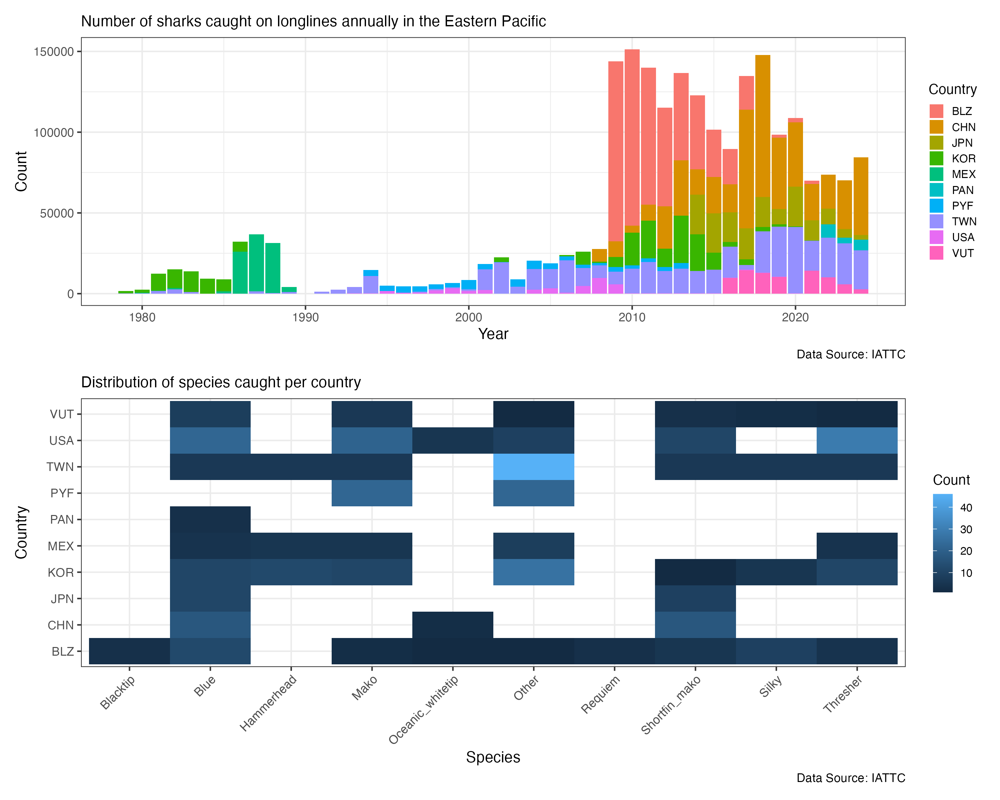
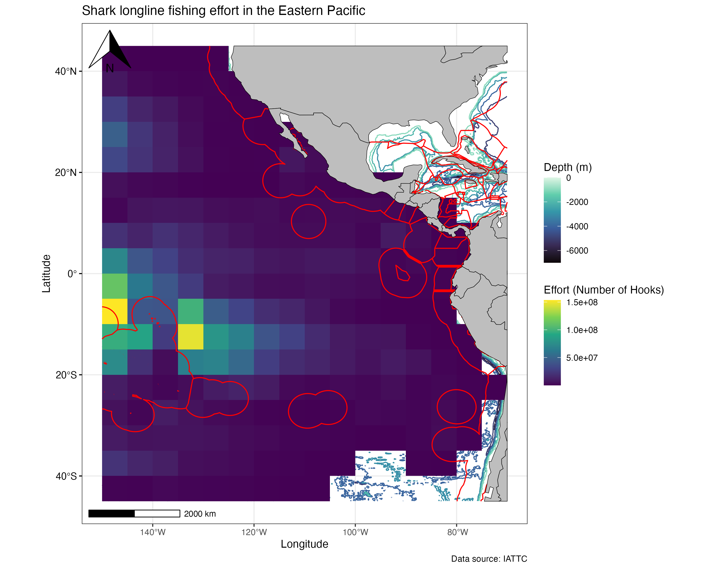

## Introduction and Objective

- More than 1/3 (37.5%) of chondrichthyans are considered threatened [@Dulvy2021_shark_extinction_crisis]
- **Overfishing is the universal threat affecting all 391 threatened species** [@Dulvy2021_shark_extinction_crisis]
- I aim to determine where shark fishing effort is concentrated in the Eastern Pacific, what countries catch the most sharks, and the distribution of species caught by country

## Data Source and Processing

- Filter IATTC Shark EPO longline catch and effort data to include year, country, species, and count [@IATTC_public_domain_data]
- Build plot visualizing number of sharks caught per year and by country
- Build plot visualizing number of sharks caught per country and by species
- Build plot displaying longline fishing effort in the Eastern Pacific [@IATTC_public_domain_data; @MarineRegions2025]

```{r}
#| code-fold: true
#Load packages
library(tidyverse)
library(EVR628tools)
library(janitor)
library(tidyr)

#Load data
shark_catch_data <- read_csv(file = "data/raw/PublicLLShark/PublicLLSharkNum.csv") |>
  rename(Latitude = LatC5,
         Longitude = LonC5) #Rename columns

#Filter data to only include number of sharks caught (no longer include weight data)
number_sharks_caught <-
  select(shark_catch_data, -c(17:26))

#Change species codes to more logical names
number_sharks_caught <- number_sharks_caught |>
  rename(Blue = BSHn,
         Blacktip = CCLn,
         Silky = FALn,
         Mako = MAKn,
         Oceanic_whitetip = OCSn,
         Requiem = RSKn,
         Miscellaneous_species = SKHn,
         Shortfin_mako = SMAn,
         Hammerhead = SPNn,
         Thresher = THRn)

number_sharks_caught <- number_sharks_caught |>
  rename(Other = Miscellaneous_species)

#Create a new column with species names
number_sharks_caught_long <- number_sharks_caught |>
  pivot_longer(cols = -c(Year, Month, Flag, Latitude, Longitude, Hooks),
               names_to = "species", values_to = "count") |>
  select(Year, Month, Flag, species, count) |>
  filter(count > 0) |>
  group_by(Year, Flag, species) |>
  summarise(count = sum(count))

```

## Main Findings

- **Belize and China have the highest annual catch since 2009**
- **Taiwan has the most consistent annual catch since 2001**
- China catches mostly Blue sharks and Shortfin Mako sharks
- Belize catches the highest distribution of species, with all represented except for Hammerheads (likely due to their Critically Endangered status) 
- Blue sharks are the most abundant species caught by Belize

## Main Findings



```{r}
#| code-fold: true
# Load libraries
library(patchwork)

# Build plot visualizing number of sharks caught per year and by country
p1 <- ggplot(data = number_sharks_caught_long,
       mapping = aes(x = Year, y = count, fill = Flag)) +
  geom_col() +
  labs(
    title = "Number of sharks caught on longlines annually in the Eastern Pacific",
    x = "Year",
    y = "Count",
    fill = "Country",
    caption = "Data Source: IATTC") +
  theme_bw() +
  theme(plot.title = element_text(size = 11)) + #Make title smaller to prevent overlap
  theme(
    legend.title = element_text(size = 10), #Make legend smaller so it looks better on combined plot
    legend.text  = element_text(size = 8),
    legend.key.size = unit(0.4, "cm"),
    legend.spacing = unit(0.1, "cm"))

# Build plot visualizing number of sharks caught per country and by species
p2 <- ggplot(data = number_sharks_caught_long,
       mapping = aes(x = species, y = Flag)) +
  geom_bin_2d() +
  theme_bw() +
  theme(axis.text.x = element_text(angle = 45, hjust = 1)) + #Make x-axis labels on a 45 degree angle to prevent overlap
  labs (
    title = "Distribution of species caught per country",
    x = "Species",
    y = "Country",
    fill = "Count",
    caption = "Data Source: IATTC") +
  theme(plot.title = element_text(size = 11)) + #Make title smaller
  theme(
    legend.title = element_text(size = 10), #Make legend smaller so it looks better on combined plot
    legend.text  = element_text(size = 8),
    legend.key.size = unit(0.5, "cm"))

# Create a two panel figure using patchwork package

p3 <- p1 / p2

```

## Main Findings

{width=60%}

```{r}
#| code-fold: true
## Load packages ---------------------------------------------------------------
library(ggspatial)     # To add map elements to a ggplot
library(rnaturalearth) # To add country outlines
library(sf)            # Working with vector data
library(terra)         # Working with raster data
library(tidyterra)     # Working with raster data in tidy approach
library(mapview)       # To quickly inspect data

## Load data -------------------------------------------------------------------
sharks_caught_clean <- read_rds(file= "data/processed/clean_number_sharks_caught.rds")
# Load depth raster
depth <- rast("data/raw/depth_raster.tif")
# Load world's coastline
coast <- rnaturalearth::ne_countries() |> st_as_sf()
# Load EEZs
EEZ <- read_sf("data/raw/World_EEZ_v12_20231025/eez_boundaries_v12.shp")

# PROCESSING ###################################################################

## Rasterize fishing effort ----------------------------------------------------

effort_raster <- sharks_caught_clean |>
  group_by(Longitude, Latitude) |>
  summarise(effort = sum(Hooks)) |> #Used number of hooks as estimate of fishing effort because no data on soak time
  rast(crs = "EPSG:4326") # Define coordinate system

# Print raster to console
effort_raster

# Quick plot
plot(effort_raster)

# Crop EEZ vector to extent of fishing effort raster
EEZ_vect <- vect(EEZ)            # convert sf → SpatVector
EEZ_unwrapped <- unwrap(EEZ_vect)  # fix 0–360 / antimeridian
EEZ_fixed <- st_as_sf(EEZ_unwrapped)

r_bb <- st_as_sfc(st_bbox(effort_raster))
EEZ_crop <- st_crop(EEZ_fixed, r_bb) # crop EEZ vector to bounds of fishing effort raster

# Crop depth raster to extent of fishing effort raster
EPO_depth <- crop(depth, r_bb)

# Crop coastline vector to extent of fishing effort raster
sf::sf_use_s2(FALSE)
coast_crop <- st_crop(coast, r_bb)

# VISUALIZE ####################################################################

## Build plot ----------------------------------------------------------------
p1 <- ggplot() +
  geom_spatraster_contour(data= EPO_depth, # Plot depth raster using contours
                          aes(colour = after_stat(level)),
                          linewidth = 0.5) +
  geom_spatraster(data= effort_raster, na.rm = TRUE) + # Plot fishing effort raster
  geom_sf(data = EEZ_crop, fill = NA, color = "red") + # Plot EEZ vector
  geom_sf(data = coast_crop,
          fill = "gray",
          color = "black") + # Plot coastline vector
  scale_fill_viridis_c(na.value = "transparent") + # Make NA value transparent for effort raster
  scale_color_viridis_c(option = "mako") + # Scale for aesthetics
  theme_bw() + # Modify theme
  theme(
    axis.text.y = element_text(color = "black", size = 10),
    axis.ticks.y = element_line(color = "black")) +
  annotation_north_arrow(location = "tl") + # Add north arrow
  annotation_scale(location = "bl") + # Add scale bar
  labs(color = "Depth (m)",
       fill = "Effort (Number of Hooks)",
       x = "Longitude",
       y = "Latitude",
       title = "Shark longline fishing effort in the Eastern Pacific",
       caption = "Data source: IATTC")

```

## References

